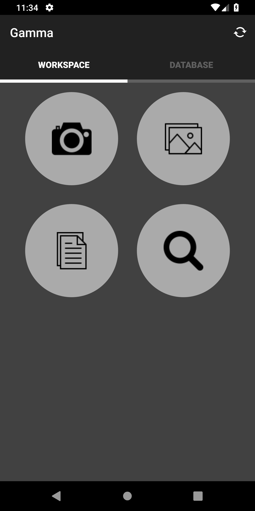
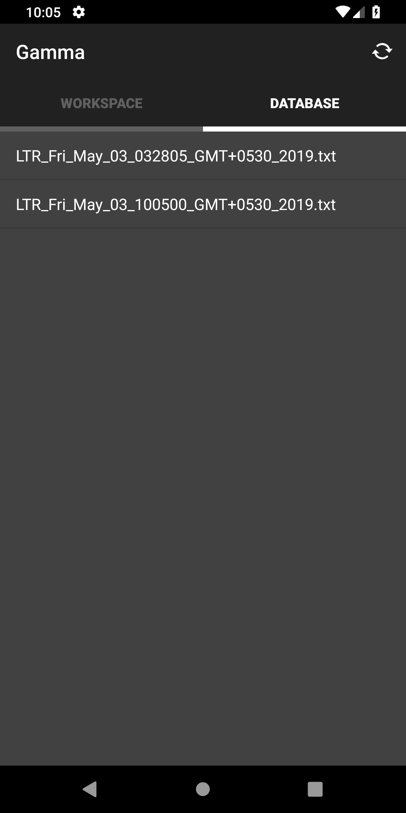

# OCR Based Document Management System

## Objective:
To design a proper document management system for official
documents and letters of IIT Patna with the feature of Optical Character
Recognition to extract the relevant text,classify the letters according to
the Name and Designation of the known faculty members (predefined)
and upload the captured text and image to their respective directories.
The objective also includes performing a search on the database of the
complete extracted text and listing all the letters found by a unique
search method.
## Brief Summary of Implementation and Innovation:
The Optical Character Recognition that the app performs to the degree
of high precision has been achieved by first performing a pre-processing
of the captured image which applies the following filters on the image:

- Converting image to a complete greyscale(Black and white image)
- Increasing the brightness of the image
- Increasing the contrast of the image

And then by using Google’s open source text recognition VISION
Application Programming interface(API) into the app.
The app then saves the extracted text and its corresponding image on a
local SSH server for which an open source library has been
implemented within the app to perform all the SSH transactions.
The file I/O related text transactions have been implemented on the SSH
account by creating specific C++ files that perform the suitable I/O
operation like appending text,copying files etc.
The search functionality of the app has been innovatively executed by
creating a text file that holds all the text that has been extracted so far
(namely, “index.txt”) with no spaces and only alphanumeric characters
with their proper tags. So, whenever a user asks for a certain search
query, the executable C++ file searches for that particular word in
“index.txt” and returns the tag name for the search.
## Results Obtained
The app has been successfully created with the expected functionalities
and has been tested and analyzed over a wide range of data, for which it
gave expected behaviour.
The Github link for the source code is
-https://github.com/vaibhav2000/MyStuff

## Screenshots

 

